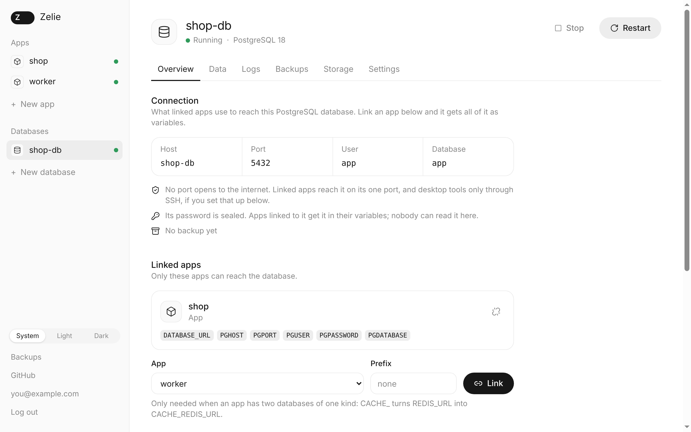
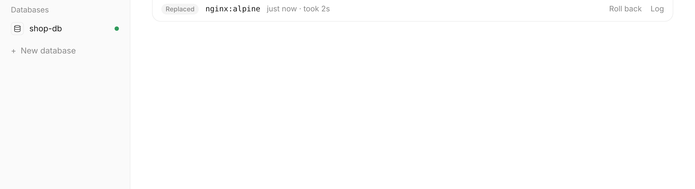

# Zelie

A server panel for your own machine. Zelie deploys apps from GitHub and runs their
databases, and game servers are next. It installs as a single file and is managed from
the browser.

> [!WARNING]
> **Pre-alpha.** Zelie is in early development. There is no release yet, and it is not
> ready for production or for any server you care about.

## What it does

- Deploys apps from a GitHub repository or a container image, with a domain and HTTPS.
- Builds with your Dockerfile, or works out the build itself with
  [Railpack](https://github.com/railwayapp/railpack).
- Runs your tests before a new version goes live, and keeps the old one if anything fails.
- Runs PostgreSQL, MariaDB and Redis, reachable only by the apps you link them to.
- Backs up databases and app volumes on a schedule, on the server and in S3.
- Shows a database's tables and keys in the browser, read-only.
- Seals secrets as they are saved, so the web interface cannot read them back.
- Asks for a passkey or an authenticator app at every login.

Coming next: game servers from Pterodactyl and Pelican eggs, a one-command installer with
updates, and several servers from one panel.

[docs/features.md](docs/features.md) describes each feature, and
[docs/architecture.md](docs/architecture.md) explains how Zelie is built and why.

## Install

Not yet. The first release will install with one command on Debian or Ubuntu, amd64 or
arm64. Until then, [CONTRIBUTING.md](CONTRIBUTING.md) shows how to build and run it.

## License

The core is free software under the [GNU AGPL v3](LICENSE). Everything on a single server
is free, with no limit on apps, databases or game servers. Running across several servers
will be part of a paid edition.

Security issues: [SECURITY.md](SECURITY.md). Made by [Cariacore](https://cariacore.com).
