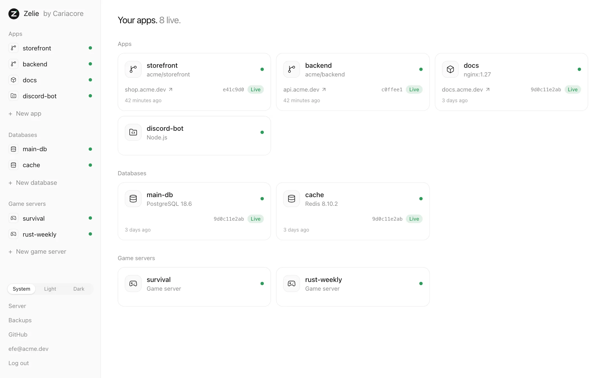
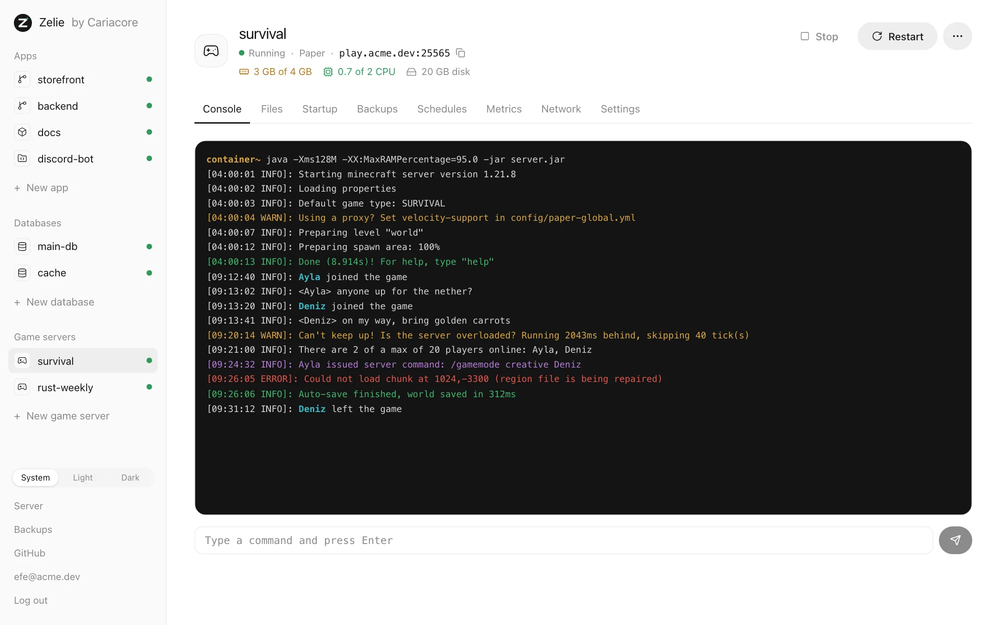
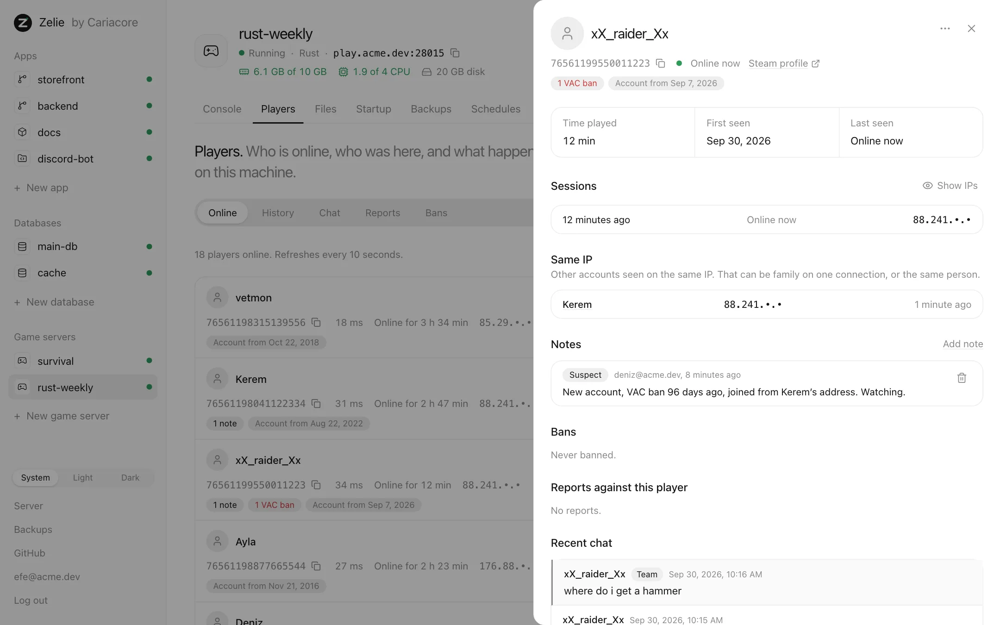
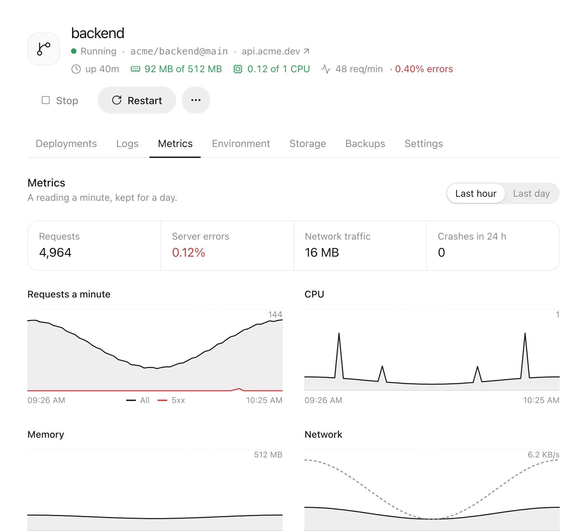

<p align="center">
  <picture>
    <source media="(prefers-color-scheme: dark)" srcset="docs/images/logo-dark.svg">
    
  </picture>
</p>

<h1 align="center">Zelie</h1>

<p align="center">
  A server panel for your own machine: game servers, apps and databases, in one binary.<br>
  <a href="https://zelie.cariacore.com">Website</a> ·
  <a href="docs/features.md">Features</a> ·
  <a href="docs/install.md">Install</a> ·
  <a href="https://zelie.cariacore.com/compare">Compare</a>
</p>

Zelie runs Minecraft, Rust and other game servers from the same eggs Pterodactyl and
Pelican use. Next to them it deploys websites, APIs and Discord bots from GitHub, a
container image or plain files, runs PostgreSQL, MariaDB and Redis, and puts it all online
with HTTPS.

It is one file. There is no PHP, no web server, no queue worker, no database server and no
Docker to install and keep up to date. One command sets it up, and the panel updates
itself.

> [!NOTE]
> **Young and moving fast.** Zelie changes often. Keep backups of what matters.

<picture>
  <source media="(prefers-color-scheme: dark)" srcset="docs/images/home-dark.webp">
  
</picture>

## Why Zelie

**Light.** Zelie's own processes use under 66 MB of memory when idle. That is checked on
every change: the test run fails if it grows past the limit. On a live server we measured
Pelican's panel, queue worker and Wings at about 230 MB, before its database and Docker.
Coolify asks for at least 2 GB of RAM. The rest of your machine goes to your players and
your apps.

**Simple to install.** One command, a few minutes, one question about how the panel is
reached. No guide with a dozen steps.

**Updates itself.** A new release is one click on the Server page. Games, apps and
databases keep running while Zelie updates, and if the new version does not come up, the
old one is put back.

**Secure by design.** The part of Zelie that runs as root has no network port. The web
panel runs as its own user, so a bug in it is not a bug with root rights. Every account
needs a passkey or an authenticator app. Secrets are sealed as they are saved, so the
panel cannot read them back.

**One panel for everything.** Your game server, its website and its database sit under one
login, with metrics and backups for each.

## Compared with other panels

|  | Zelie | Pterodactyl | Pelican | Coolify |
|---|---|---|---|---|
| Install | One command | Manual guide | Manual guide | One command |
| Runs on | One Go binary | PHP, Laravel, MySQL, Redis | PHP, Laravel | PHP, Laravel, PostgreSQL, Redis |
| Needs Docker | No, its own containerd | Yes, for Wings | Yes, for Wings | Yes |
| Idle memory | Under 66 MB | PHP panel, queue worker and Wings | About 230 MB, before the database | At least 2 GB of RAM asked for |
| Updates from the panel | ✅ With automatic rollback | ❌ | ❌ | ✅ |
| Pterodactyl and Pelican eggs | ✅ | ✅ | ✅ | ❌ |
| Console, files, SFTP, schedules | ✅ | ✅ | ✅ | ❌ |
| Players and RCON tools | Rust and Minecraft | Not built in | Not built in | ❌ |
| Deploys from GitHub | ✅ | ❌ | ❌ | ✅ |
| Rollback in a click | ✅ | ❌ | ❌ | ✅ |
| Databases | PostgreSQL, MariaDB, Redis | MySQL for game servers | MySQL for game servers | Many |
| Automatic HTTPS for apps | ✅ | ❌ | ❌ | ✅ |
| Two-step login | Required for everyone | Optional | Optional | Optional |
| Root part reachable from the network | No | Wings, on a public port | Wings, on a public port | SSH as root |
| Encrypted backups to S3 | ✅ | Not encrypted | Not encrypted | Databases only |
| Several machines from one panel | Planned | ✅ | ✅ | ✅ |
| Sub-users | Planned | ✅ | ✅ | Teams |

The other panels are described as they install by default. The [comparison
page](https://zelie.cariacore.com/compare) has the details, and a note on each measurement.

## Game servers

- **21 games ready to pick**, from Pelican's egg repositories: Minecraft (Vanilla, Paper,
  Purpur, Fabric, Forge, NeoForge, Velocity, Bedrock), Rust, Valheim, Palworld, ARK:
  Survival Ascended, 7 Days to Die, Counter-Strike 2, Enshrouded, Garry's Mod, Project
  Zomboid, Satisfactory, Sons of the Forest, Squad and V Rising. Each is downloaded and
  checked on every release. Any other Pterodactyl or Pelican egg can be imported by its
  link.
- **A live console** with colours and history, start, stop, restart and kill. When a server
  crashes, Zelie reads its last lines and says why: out of memory, the wrong Java, a port
  in use, the EULA. Where it can, it offers the fix.
- **Files and SFTP.** A file manager with a code editor, upload by dragging, archives, and
  SFTP that reaches one server's files and nothing else.
- **Ports you choose.** A pool of ports on one IP or several; you pick which port the
  game, query, RCON or Rust+ gets.
- **Schedules and backups.** Console commands, restarts and backups at cron times. For
  Minecraft, the world is saved before a backup.
- **Steam updates.** Zelie checks each hour whether a Steam game is behind, and can update
  it when nobody is playing.

<picture>
  <source media="(prefers-color-scheme: dark)" srcset="docs/images/console-dark.webp">
  
</picture>

## Players

For Rust and Minecraft servers, the Players tab is an RCON-style admin panel that is part
of Zelie, with nothing to install. It shows who is online with ping, time online and
address, and keeps everyone seen in the last 30 days. Accounts seen on the same address are
listed together, which helps when a banned player comes back with a new one.

Chat is kept for 7 days, global and team apart, and can be searched. You can kick and ban
with a reason and an optional end, which Zelie lifts by itself while the server runs.
Minecraft servers also get op and the whitelist. Notes on players and a log of what admins
did are kept too. With a free Steam Web API key, players show their VAC and game bans and
the age of their account.

Rust is asked over its WebRCON with the server's own password, only while the tab is open.
Minecraft is asked through its console. Some other Steam games get a list of who is online.

<picture>
  <source media="(prefers-color-scheme: dark)" srcset="docs/images/players-dark.webp">
  
</picture>

## Apps and databases

- **From GitHub**, public or private. Every push builds, runs your tests and passes a health
  check before traffic moves over. If any step fails, the old version keeps serving. The
  last five versions stay ready to roll back.
- **From a container image**, or from a folder of your own files run with Node.js, Python,
  Bun, Deno or Java: a Discord bot or a site that used to live on a game panel.
- **Builds** with your Dockerfile, or [Railpack](https://github.com/railwayapp/railpack)
  works out the build.
- **Databases.** PostgreSQL, MariaDB and Redis, with no port open to the internet. Link one
  to an app and it gets `DATABASE_URL`. Browse tables and keys in the panel, and move to a
  new major version with a backup taken first.
- **Metrics.** Requests, errors, memory, CPU and traffic for every app, a reading a minute.

<picture>
  <source media="(prefers-color-scheme: dark)" srcset="docs/images/app-metrics-dark.webp">
  
</picture>

## Backups

Databases, app files and game worlds on a schedule, compressed and encrypted on the
server, with copies in any S3-compatible storage. A restore first backs up what is there,
and a new server can find its backups in S3 and bring them back.

[docs/features.md](docs/features.md) goes through every feature, and
[docs/architecture.md](docs/architecture.md) explains how Zelie is built and why.

## Install

On a Debian or Ubuntu server with systemd, amd64 or arm64, as root:

```sh
curl -fsSL https://github.com/Caria-Core/zelie/releases/latest/download/install.sh | sh
```

The script checks the release's signature before it installs anything. Then it asks how
people will reach the panel:

1. **A domain** that points to the server. Zelie gets certificates from Let's Encrypt.
   Choose this when nothing else serves websites on the server.
2. **A Cloudflare Tunnel.** No port opens to the internet. Choose this when your domain is
   on Cloudflare, when another web server already has ports 80 and 443, or when the server
   is behind NAT.
3. **The server's IP address**, with a self-signed certificate. Only for trying Zelie out.

It ends with a link to create the administrator. [docs/install.md](docs/install.md) walks
through every step and what the install changes on the server. To build Zelie yourself,
see [CONTRIBUTING.md](CONTRIBUTING.md).

## License

The core is free software under the [GNU AGPL v3](LICENSE). Everything on a single server
is free, with no limit on apps, databases or game servers. Running across several servers
will be part of a paid edition.

Security issues: [SECURITY.md](SECURITY.md). Made by [Cariacore](https://cariacore.com).
