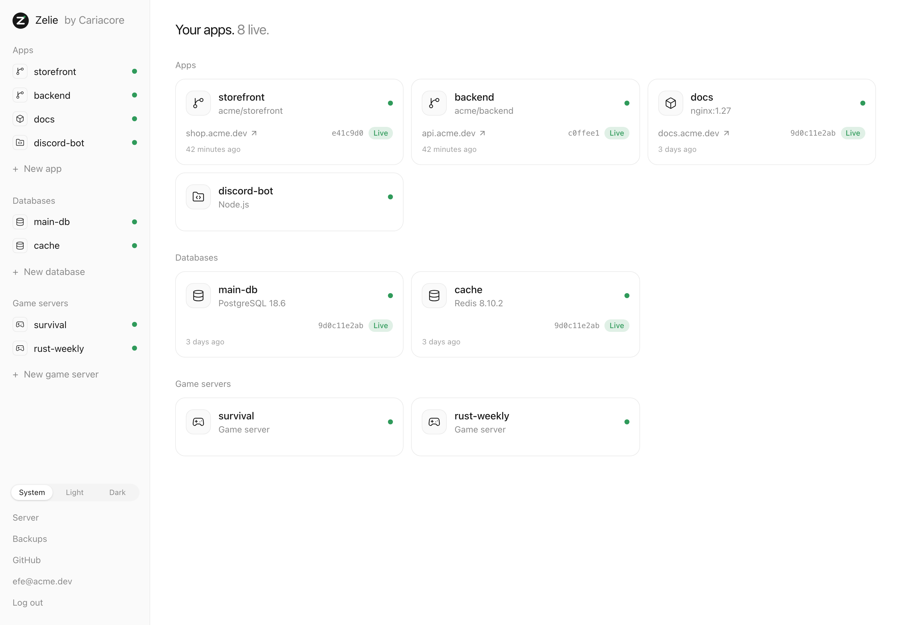

# Zelie Panel

Zelie is a server panel for your own machine. It runs websites and APIs from GitHub or a
container image, databases, and game servers such as Minecraft and Rust, and puts them
online with HTTPS. You skip the setup: no reverse proxy to configure, no certificates to
renew, no Dockerfile unless you want one.

It is meant to replace older panels such as Pterodactyl, Pelican and cPanel with
something lighter and safer. Zelie is a single binary with no web server, PHP or database
server of its own to look after. Every app, database and game server runs in its own
locked-down container, and one command installs the whole thing.

> [!WARNING]
> **Alpha.** Zelie runs real sites and game servers, but it changes quickly and has had
> not run on many servers yet. Keep your own backups, and wait before you move
> anything important onto it.



## What it does

**Apps.** Deploy a GitHub repository, public or private, and every push to its branch
goes live. Zelie builds it with your Dockerfile, or works out the build itself with
[Railpack](https://github.com/railwayapp/railpack). A new version starts next to the old
one and only takes over once it answers; if the build, the tests or the start fail, the
old version keeps serving. Any container image works too, and so does a folder of your
own files run with Node.js, Python, Bun, Deno or Java.

**Databases.** PostgreSQL, MariaDB and Redis, with no port open to the internet. Link one
to an app and the app gets `DATABASE_URL`. Browse tables and keys in the panel,
read-only, and update to a new version with a backup taken first.

**Game servers.** Minecraft, Rust, Valheim, Palworld and a dozen more from the list, or
any Pterodactyl or Pelican egg by its link. A live console, a file manager, SFTP, startup settings,
schedules and backups. Zelie opens the game's ports while the server exists, and for
Steam games tells you when an update is out.


**Backups.** Databases, app files and game worlds on a schedule, encrypted on the server,
with copies in any S3-compatible storage. A restore first backs up what is there.

**Metrics.** Requests, server errors, memory, CPU and traffic for every app, a reading a
minute, kept for a day.

**Logins.** Every administrator needs a passkey or an authenticator app. Secrets are
sealed as they are saved, so the web interface cannot read them back, and SFTP never
accepts an account's password.


[docs/features.md](docs/features.md) goes through every feature, and
[docs/architecture.md](docs/architecture.md) explains how Zelie is built and why.

## Install

On a Debian or Ubuntu server with systemd, amd64 or arm64, as root:

```sh
curl -fsSL https://github.com/Caria-Core/zelie/releases/latest/download/install.sh | sh
```

The script checks the release's signature before it installs anything. Then it asks one
question, how people will reach the panel:

1. **A domain** that points to the server. Zelie gets certificates from Let's Encrypt.
   Choose this when nothing else serves websites on the server.
2. **A Cloudflare Tunnel.** No port opens to the internet. Choose this when your domain
   is on Cloudflare, when another web server already has ports 80 and 443, or when the
   server is behind NAT.
3. **The server's IP address**, with a self-signed certificate. Only for trying Zelie
   out.

It ends with a link to create the administrator. After that, updates are one click on the
panel's Server page. [docs/install.md](docs/install.md) walks through every step and what
the install changes on the server.

To build Zelie yourself, see [CONTRIBUTING.md](CONTRIBUTING.md).

## License

The core is free software under the [GNU AGPL v3](LICENSE). Everything on a single server
is free, with no limit on apps, databases or game servers. Running across several servers
will be part of a paid edition.

Security issues: [SECURITY.md](SECURITY.md). Made by [Cariacore](https://cariacore.com).
