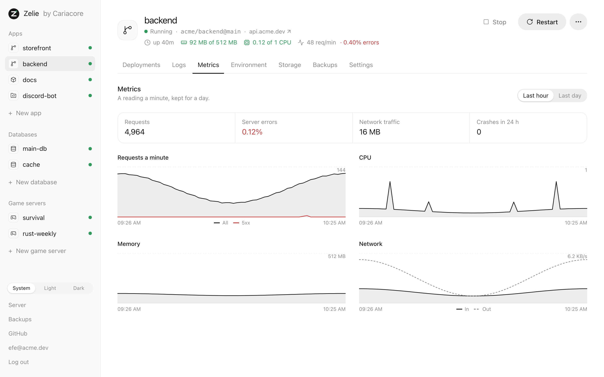
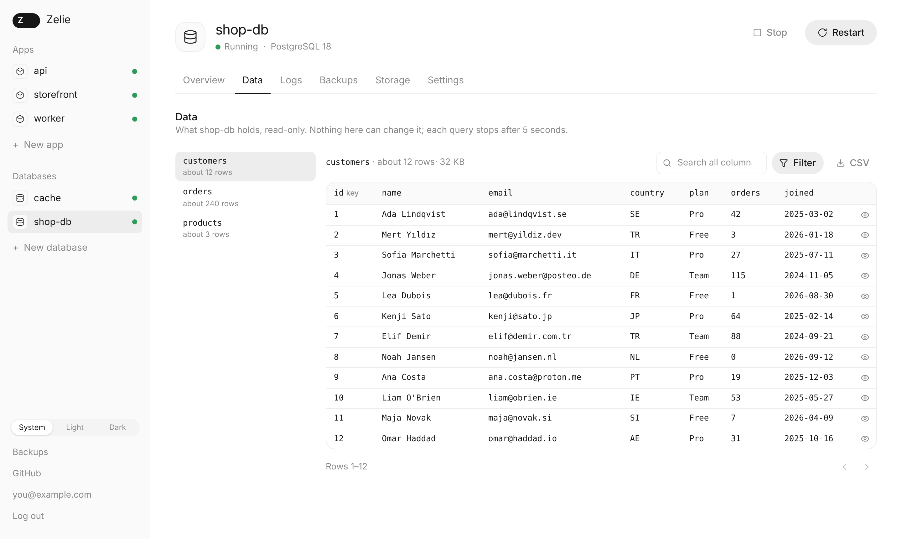
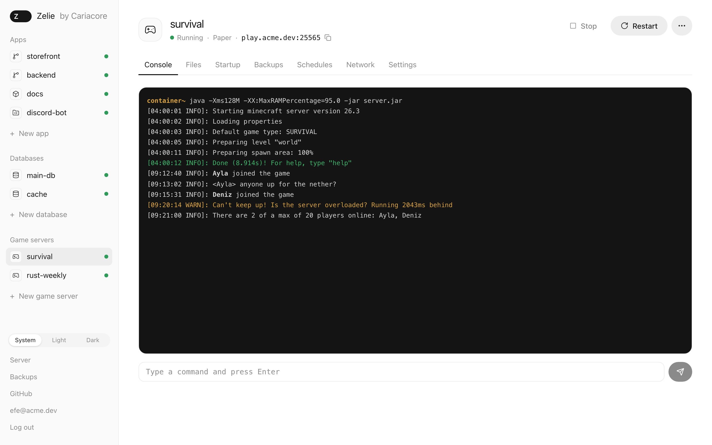

# Features

What Zelie does today, one area at a time. It is alpha: all of this works, and some of it
runs on a real server, but where something has only been tried in tests or against a
stand-in, it says so.

## Apps

An app comes from one of three places.

- **GitHub.** Connecting GitHub creates a GitHub App in your own account or
  organization, with access only to the repositories you pick. Private repositories
  work. Each push to the app's branch deploys it, if you leave that on. A push only
  deploys the apps set to that repository and that branch, so one GitHub App can serve
  many apps without them getting in each other's way.
- **A container image.** Any public image, such as `nginx:1.27`. Zelie checks the
  registry once a day and offers the new image when the tag has moved.
- **Your own files.** Pick a runtime, Node.js, Python, Bun, Deno or Java, and upload the
  files, or send them over SFTP. Restarting runs them again. This suits a Discord bot or
  a site that used to live on a game panel. There is no build step and no rollback here:
  the files are the app.

Every app has:

- **Variables.** Plain and secret ones, or a whole `.env` file pasted in. A secret is
  sealed as it is saved and only the privileged core can open it. Builds get variables as
  BuildKit secrets, which stay out of the image.
- **Storage.** Volumes that outlive deployments, each with a size limit you can raise.
- **Limits.** Memory and CPU, set against what the server has and what the other apps
  were given.
- **Logs**, live in the browser.

## Builds and deployments

- A repository with a Dockerfile is built with it. Without one, Railpack works out the
  build for Node, Python, Go, static sites and more. Zelie shows the build and start
  commands Railpack chose, and either can be replaced.
- When a Node project has a test script, it runs on each new build first, with the app's
  variables. A failing test keeps the old version. The command can be changed or left
  empty.
- A new version starts next to the old one. An app with a domain must answer on its
  health check path within a minute before traffic moves over. If the build or the start
  fails, the old version keeps serving and the log shows why.
- The last five versions that went live keep their image, so a rollback takes a second
  or two.
- An app that stops by itself, or a server that restarts, brings the live version back,
  waiting longer after each crash. After five crashes in ten minutes the app stays down
  and the panel says why.

## Domains and HTTPS

Give an app a domain and the proxy routes it. Installed with a domain, Zelie gets a
certificate for it from Let's Encrypt; behind a Cloudflare Tunnel, Cloudflare handles
HTTPS and you add the domain there. The tunnel runs on a real server. Getting
certificates from Let's Encrypt has so far run against a stand-in only.

## Metrics

Every app gets a reading a minute, kept for a day: requests and server errors from the
proxy, memory, CPU and network traffic. The app's page shows the last hour or the last
day, with the error rate and the crashes of the last 24 hours. The header of every app
page shows its memory and CPU as they are now.

## Databases

- PostgreSQL 18 and 17, MariaDB 11.8 and 10.11, and Redis 8, each in its own container
  with its own volume.
- No port opens to the internet. Link a database to an app or a game server and it
  reaches the database by name and gets `DATABASE_URL` or `REDIS_URL`, along with the
  engine's usual variables. The password is sealed. An administrator can have it shown,
  for a game plugin's config file, after confirming it is them; each time is logged.
- **Updates.** When a new patch release of the image is out, the panel offers it, and
  backs up before it switches. Moving to a new major version, such as PostgreSQL 17 to
  18, dumps the data, loads it into the new version on a new volume, and goes back to the
  old one if anything fails. The old volume stays until you delete it.
- **Data tab.** Tables, rows, filters by column, search, sorting and CSV export, and for
  Redis, keys and their values. Everything is read-only: the core builds each query
  itself and runs it in a read-only transaction with a time limit.
- **From your computer.** Tools like TablePlus or DBeaver can connect through an SSH
  tunnel to a port only the server itself can reach, as a user of their own whose
  password is shown once.

## Game servers

Game servers run from the eggs Pterodactyl and Pelican use, so the games their community
supports run here too.

- **Games.** Minecraft (Vanilla, Paper, Purpur, Fabric, Forge, NeoForge, Velocity and
  Bedrock), Rust, Valheim, Palworld, 7 Days to Die, ARK: Survival Ascended, Counter-Strike 2,
  Enshrouded, Garry's Mod, Project Zomboid, Satisfactory, Sons of the Forest, Squad and
  V Rising are in the list, from Pelican's egg repositories at a commit each Zelie release
  names. Every entry is downloaded and checked in CI. Any other egg can be imported by its
  link, in either the Pterodactyl or the Pelican format.
- **Passwords.** An RCON or admin password the egg leaves empty, or sets to a placeholder such
  as `changeme`, gets a random value when the server is made. The password players join with
  is left as the egg has it, unless the egg requires one and has none.
- **Creating one.** Pick the game, then memory, CPU, disk and the image, such as the Java
  version, then ports. Memory, CPU and disk can be changed later on the Settings tab. The egg's install script runs once in its own container. For
  Minecraft, the panel asks you to accept Mojang's EULA first.
- **Ports.** Game servers take their ports from a pool you set up once, on one IP or
  several. Each port has its use, such as the game, query, RCON or Rust+ port, and you
  choose which port of the pool each one gets, when you create the server and later on
  the Network tab. Zelie forwards them to the container with nftables, allows them in ufw when it
  is on, and closes them when the server is deleted. Players connect straight to the
  server; game traffic never goes through a tunnel.
- **Console.** Live output with colours, the last 500 lines on opening, and a command
  line with history. Start, stop, restart and kill. Stopping sends the egg's stop
  command and kills the server if it has not stopped after a minute.
- **Files.** A file manager with an editor, upload by dragging, download, rename and
  move. It packs files into a `.tar.gz` and unpacks `.zip` and `.tar` archives. The same
  files are reachable over SFTP.
- **Startup.** The startup command, the image and the egg's variables, checked against
  the egg's rules and used on the next start. Some eggs lock variables; the lock holds
  for users who are not administrators.
- **Schedules.** Cron times, or ready-made ones, each running a list of tasks in order: a
  console command, a power action or a backup, with a wait before each. A schedule can
  skip its run when the server is stopped.
- **Backups.** The server's files on a schedule, like any volume. For Minecraft, Zelie
  saves the world and pauses saving while the backup runs.
- **Steam updates.** For Steam games, Zelie asks Steam once an hour which build is the
  latest and shows when the server is behind. It can update by itself when nobody is
  playing. A reinstall or an update takes a backup first.
- **Clone.** The menu next to Start makes a new server from this one: same egg, settings and
  limits, every file, and new ports from the pool for the same jobs. Schedules, backups and
  the SFTP password stay behind, and passwords Zelie made up for the original, such as RCON,
  are made up again. The copy starts stopped.
- **Crashes** are handled as for apps. The header shows the server's limits, and its
  memory and CPU use while it runs.

Minecraft runs end to end in Zelie's tests on every change, including a console command
and a player's ping. Rust and the Steam update check have run against stand-ins only.

## Players

For Rust and Minecraft servers, and as a plain list for some other Steam games.

- **Online.** Who is on now, with ping, time online and address (hidden until you show
  it). Rust is asked over its WebRCON with the server's own password, only while the tab
  is open; Minecraft through its console; other games through the Steam query.
- **History.** Joins and leaves are read from the console while the server runs, so a
  player's visits, play time and first and last time seen are kept for 30 days. Accounts
  seen on the same address are listed together.
- **Chat** is kept for 7 days, global and team apart, searchable.
- **Kick, ban and unban**, with a reason. A ban can be for a time; Zelie lifts it when it
  ends. Minecraft servers also get op and the whitelist.
- **Notes** on a player, and a list of what admins did and when.
- **Steam.** With a free Steam Web API key on the Server page, players show their VAC and
  game bans and how old their account is.
- **Reports.** F7 reports are read from the console once their format is confirmed on a
  live server; until then the section stays empty and says so.

## SFTP

- One SFTP server for all game servers and files apps, on port 2222 unless you choose
  another. The login name is the server's name.
- Log in with an SSH key added on the Account page, or with a password made for that one
  server, shown once. An account's own password never works over SFTP, so SFTP is no way
  around the second login step.
- A login reaches that server's files and nothing else on the machine. The SFTP server
  runs as its own user with no rights of its own; it asks the core for every file, and
  the core only lets it near the volumes of game servers and files apps, never a
  database's.
- Wrong passwords are limited per address and per server.
- The server starts when someone connects and stops after five idle minutes.

## Backups

- Databases are backed up every night at 3:00 and kept for seven days, unless you change
  it. Apps and game servers can be backed up on a schedule too, running or stopped for a
  consistent copy.
- Backups are compressed and encrypted on the server. The key stays with the core, and a
  recovery file lets another server open them.
- Copies can go to any S3-compatible storage, kept for 30 days by default. A new server
  can find them there and restore them.
- A dump from elsewhere (`.sql`, `.sql.gz`, a Redis `.rdb`) can be uploaded to restore a
  database. Statements that only fit the old server are left out and counted.
- A restore first backs up what is there. If the restore fails, that backup goes back.

## Logins

- Every administrator needs a passkey or an authenticator app as well as a password,
  with ten recovery codes as a fallback.
- Changing any of these, restoring a backup or exporting data asks for a fresh second
  step.
- Too many wrong passwords from one address or for one account lock logins for a while.
  After a few, each attempt also needs a small proof of work the browser solves, which
  slows a script down and sends nothing to a third party.
- The Account page lists every browser that is logged in and can log any of them out.
- Locked out for good, `zelie reset-login` on the server prints a link to start again.

## Housekeeping

- The build cache is kept to a tenth of the disk, at most 20 GB.
- Images nothing has used for a week are deleted. Images the last five deployments need
  for a rollback stay.

## Install and updates

[install.md](install.md) has the details.

- One command installs Zelie and asks how the panel is reached. The release's signature
  is checked first. Running it again finishes an install that stopped halfway, and
  updates an older one.
- The Server page shows when a new release is out and what changed. Updating restarts
  only Zelie's own services; apps, databases and game servers keep running. If the new
  version does not come up within a minute and a half, the old one is put back.

## Interface

Light and dark themes, usable on a phone, and built into the binary: no separate web
server, no CDN, no tracking. Every sentence it shows is kept apart from the code, ready
to be translated; English is the only language so far.

## Not yet

- Users other than administrators, and permissions per game server.
- Several servers managed from one panel.
